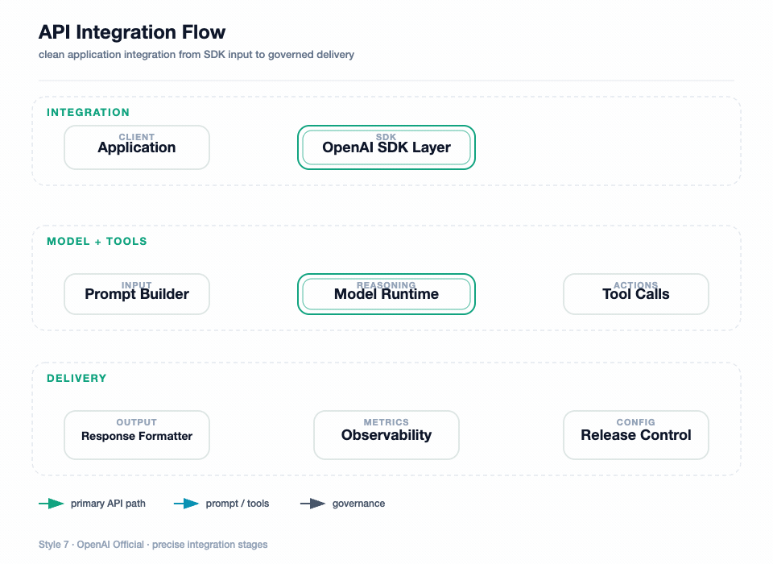
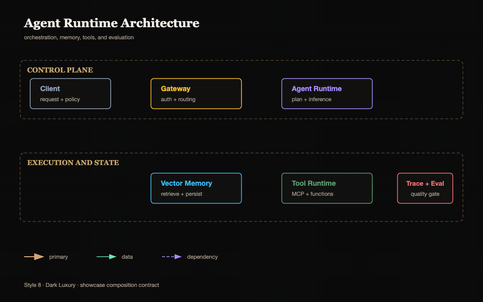
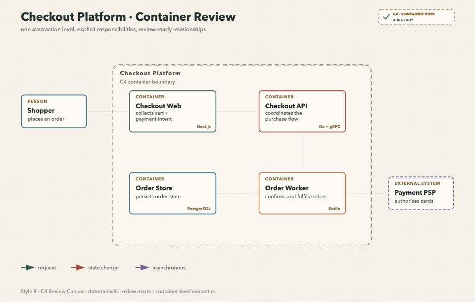
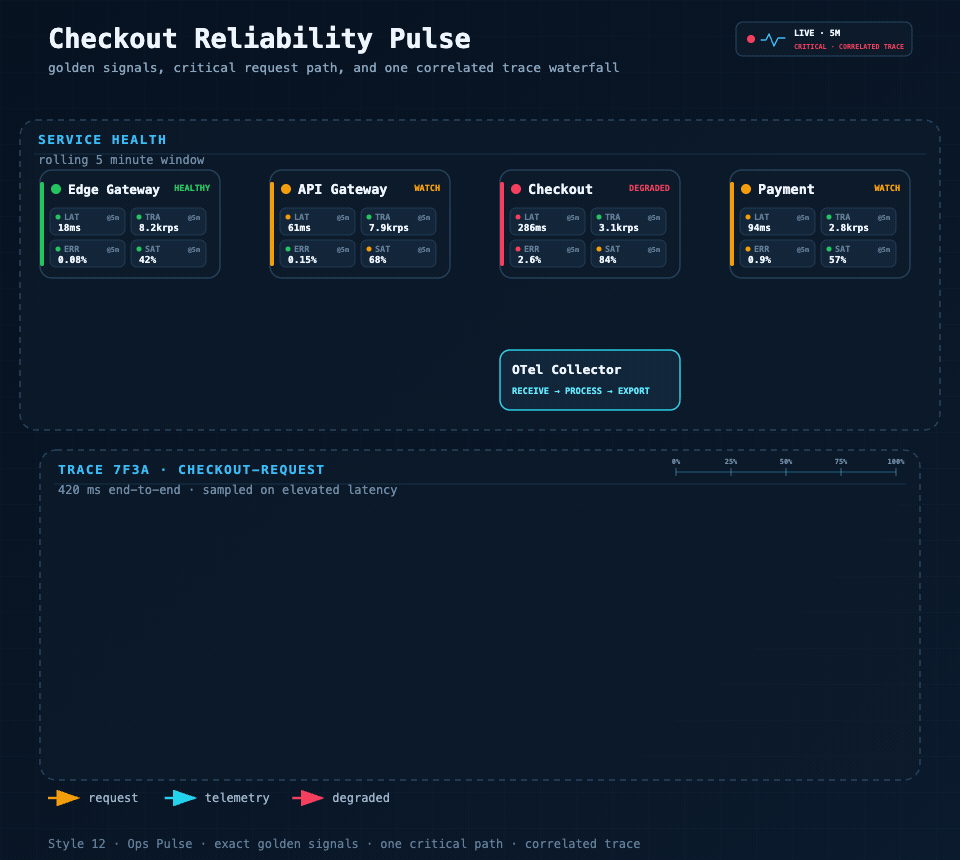

[English](README.md) | [中文](README.zh.md)

# fireworks-tech-graph

> **Stop drawing diagrams by hand.** Describe your system in English or Chinese — get geometry-safe SVG, PNG, focused SVG-to-GIF motion, and offline interactive technical diagrams.

[](LICENSE)
[](https://github.com/yizhiyanhua-ai/fireworks-tech-graph/releases)
[](https://learn.chatgpt.com/docs/build-skills)
[](https://code.claude.com/docs/en/skills)
[]()
[]()
[]()

---

## Overview

`fireworks-tech-graph` is one Agent Skill that works unchanged in **Codex and Claude Code**. It turns natural language descriptions into polished, geometry-checked SVG diagrams, high-resolution PNGs, validated SVG-to-GIF semantic motion, and offline interactive HTML. The focused animation path accepts a generated semantic SVG and emits one compact, probed GIF. It ships with **11 generator-backed styles** and **1 AI-authored style (Dark Luxury)**. Four engineering-first styles add executable contracts for C4 reviews, cloud deployments, event streams, and reliability investigations, alongside deep AI/Agent domain patterns and all 14 UML diagram types.

```
User: "Generate a Mem0 memory architecture diagram, dark style"
  → Skill classifies: Memory Architecture Diagram, Style 2
  → Generates SVG with swim lanes, cylinders, semantic arrows
  → Exports 1920px PNG
  → Reports: mem0-architecture.svg / mem0-architecture.png
```

---

## Work With the Builder

This project is also a proof surface for a broader capability: turning vague AI/devtool workflows into constrained, reusable systems with validation, documentation, export paths, and product-facing polish.

If you are building agent infrastructure, AI IDEs, internal copilots, developer tools, technical documentation systems, or applied AI workflow products, I am open to scoped paid sprints, design-partner work, and founding engineer conversations.

- Founder-facing profile: https://bradzhang.dev/en
- Commercial case study: https://bradzhang.dev/en/case-studies/fireworks-tech-graph
- Work with me: https://bradzhang.dev/en/work-with-me

---

## Showcase

> The animated previews use the user-approved 5.75-second settled-flow timeline: routes draw in first, then the final topology keeps live data moving for two additional seconds. Each full-size GIF is 960px wide at 20fps / 115 frames; the 3×4 overview is an optimized 1200px preview. Lossless 1920px PNGs remain in `assets/samples/` as static regression baselines.


The v1.2.0 overview above and every full-size animated sample below come from the approved regression set. Each style keeps a distinct scenario while sharing the same geometry, text-fit, wire-routing, and semantic-motion quality gates.

### Style 1 — Flat Icon (default)
*Mem0 Memory Architecture — personal-memory extraction, conflict resolution, storage, and retrieval*


### Style 2 — Dark Terminal
*Tool Call Flow — dark terminal execution, source grounding, retrieval, and answer synthesis*


### Style 3 — Blueprint
*Microservices Architecture — engineering grid, domain services, data stores, events, and telemetry*


### Style 4 — Notion Clean
*Agent Memory Types — minimal hierarchy from sensory and working context to durable memory*


### Style 5 — Glassmorphism
*Multi-Agent Collaboration — coordinator, specialists, shared state, review, and synthesis*


### Style 6 — Claude Official
*System Architecture — warm interface, runtime, safety, memory, tools, and operations layers*


### Style 7 — OpenAI Official
*API Integration Flow — clean SDK, prompt, model, tool, delivery, and release stages*


### Style 8 — Dark Luxury *(AI-authored)*
*Agent Runtime Architecture — control plane, execution and state layers, champagne-gold structure, semantic color buckets*


### Style 9 — C4 Review Canvas
*Checkout Container Review — one abstraction level, explicit responsibilities, technologies, and protocols*


### Style 10 — Cloud Fabric
*Active–Active Checkout Deployment — global ingress, regions, VPC ownership, and cross-region replication*


### Style 11 — Event Transit
*Checkout Event Line — topics as rails, processors as stations, a declared junction, DLQ, and state projection*


### Style 12 — Ops Pulse
*Checkout Reliability Pulse — golden signals, one critical path, OTel export, and a correlated trace*


---

## Stable Prompt Recipe

The public showcase keeps a distinct domain scene for every style. They remain comparable because every fixture passes the same executable composition contract. A same-topology regression set remains internal under `fixtures/quality-baseline/`.

```text
Draw the scenario assigned to style N:
1 Mem0 Memory Architecture; 2 Tool Call Flow; 3 Microservices Architecture;
4 Agent Memory Types; 5 Multi-Agent Collaboration; 6 System Architecture;
7 API Integration Flow; 8 Agent Runtime Architecture; 9 C4 Checkout Review;
10 Active–Active Cloud Deployment; 11 Checkout Event Line; 12 Checkout Reliability Pulse.
Preserve the scenario-specific nodes, sections, and reading direction.
Apply the showcase composition contract: zero crossings, zero bridge jumps, at most two bends per edge,
at most eight bends overall, at least 40px between nodes, at least 20px container gutter,
short orthogonal segments, and labels kept clear of nodes, routes, and section headers.
Preserve the selected style's typography, palette, card material, and brand details.
```

For the four engineering-first styles, use one of these prompt fingerprints so
the router selects the domain contract as well as the visual theme:

```text
Style 9 · C4 review board: show one C4 level, responsibilities, technologies, review state, and relationship protocols.
Style 10 · Multi-region deployment map: show global ingress, Region/VPC ownership, neutral cloud glyphs, deployment mode, and named boundary mechanisms.
Style 11 · Event metro map: show thin topic rails, numbered processor stations, declared junctions, consumer groups, DLQ, and state projections.
Style 12 · Reliability pulse: show one observation window, four golden signals per service, numbered critical hops, telemetry export, and one correlated trace.
```

Replace `N` with `1`–`12`. Style 8 remains AI-authored and loads `references/style-8-dark-luxury.md`; Styles 9–12 also enforce their engineering semantic contract. All styles load `references/composition-quality-contract.md`.

---

## Features

- **12 visual styles** — 11 generator-backed profiles + 1 AI-authored style (Dark Luxury)
- **Engineering semantic contracts** — C4 abstraction levels, deployment ownership, event-rail topology, and exact golden signals fail closed before rendering
- **Executable style system** — style guides are encoded into the generator, not only documented in markdown
- **Shared composition-quality contract** — every official style enforces zero crossings/bridges, ≤2 bends per edge, route-stretch, spacing, gutter, micro-segment, and label-clearance budgets
- **14 diagram types** — Full UML support (Class, Component, Deployment, Package, Composite Structure, Object, Use Case, Activity, State Machine, Sequence, Communication, Timing, Interaction Overview, ER Diagram) plus AI/Agent domain diagrams
- **AI/Agent domain patterns** — RAG, Agentic Search, Mem0, Multi-Agent, Tool Call, and more built-in
- **Semantic shape vocabulary** — LLM = double-border rect, Agent = hexagon, Vector Store = ringed cylinder
- **Semantic arrow system** — color + dash pattern encode meaning (write vs read vs async vs loop)
- **Geometry-safe routing** — deterministic orthogonal routes, exact waypoints, distinct ports, automatic legend relocation, labels kept inside the canvas, and verified bridge jumps for unavoidable crossings
- **Versioned diagram IR** — legacy JSON normalizes to schema v1; duplicate IDs, dangling references, malformed waypoints, and non-finite geometry fail before rendering
- **Structured SVG validation** — XML and marker integrity plus semantic node, reserved-region, label, canvas, edge-overlap, and edge-crossing checks
- **Unified CLI + interactive export** — render, validate, inspect, and export one offline HTML file with pan/zoom, themes, copy, and SVG/PNG/JPEG/WebP output up to 4×
- **Focused semantic GIF motion** — generated SVG in, validated GIF out; connectors begin absent and draw in semantic order. All twelve style contracts are user-approved. The shared `+2s-settled-flow` timing revision is also user-approved, so the default 5.75s/115-frame loop holds full settled flow on frames 38–109, then resets on 110–114
- **Visual review gate** — exported PNGs are inspected for clipping, overlap, label placement, and routing regressions before delivery
- **Product icons** — 40+ products with brand colors: OpenAI, Anthropic, Pinecone, Weaviate, Kafka, PostgreSQL…
- **Swim lane grouping** — automatic layer labeling for complex architectures
- **SVG + PNG output** — SVG for editing, 1920px PNG for embedding
- **Renderer-friendly** — pure inline SVG, no external font fetching; renders cleanly in cairosvg, rsvg-convert, and headless Chrome

---

## Loop Engineering

The first render is treated as a candidate, not an automatic final result. `fireworks-tech-graph` uses an agent-driven, bounded validation feedback loop to move each diagram toward a verified deliverable:

```text
Prompt
  → Diagram Contract
  → Semantic IR
  → Style Spec
  → Route Planner
  → SVG Build
  → Structural Validation
  → PNG Visual Readback
  → Targeted Revision
  → Verified SVG + PNG
```

The loop follows five design principles:

1. **Evaluate, don't assert** — completion is backed by validator and render evidence, not by the model saying the diagram looks correct.
2. **Deterministic checks first** — XML structure, marker integrity, path geometry, arrow-component collisions, and renderability are checked before visual judgment.
3. **Perceptual validation second** — the exported PNG is read back to inspect clipping, label collisions, hierarchy, whitespace, and routing quality that syntax checks cannot see.
4. **Targeted correction** — each pass changes only the diagnosed labels, coordinates, corridors, or spacing, then reruns validation and rendering.
5. **Bounded convergence** — visual review allows at most two focused correction passes by default, preventing an unbounded self-editing loop.

The loop is observable in the final status:

```text
validation: passed
visual_review: passed
```

If the runtime cannot read images, the skill reports `visual_review: skipped (image reader unavailable)` explicitly. The workflow remains bounded and auditable; it does not claim visual verification without image evidence.

---

## Installation

### Recommended: install the complete skill for both runtimes

Use the real nested skill path. The final `/skills/fireworks-tech-graph` segment is required because a bare repository install can select only the root `SKILL.md` in current versions of `skills` CLI.

```bash
npx -y skills@1.5.17 add \
  yizhiyanhua-ai/fireworks-tech-graph/skills/fireworks-tech-graph \
  --agent codex claude-code -g -y --copy
```

This creates complete copies at `~/.agents/skills/fireworks-tech-graph` for Codex and `~/.claude/skills/fireworks-tech-graph` for Claude Code, including scripts, schemas, fixtures, templates, tests, references, and metadata.

### Editable Git checkout for Codex

```bash
mkdir -p ~/.agents/skills
git clone https://github.com/yizhiyanhua-ai/fireworks-tech-graph.git ~/.agents/skills/fireworks-tech-graph
```

Codex discovers personal skills from `~/.agents/skills` and reads the optional `agents/openai.yaml` metadata included in this repository.

### Editable Git checkout for Claude Code

```bash
mkdir -p ~/.claude/skills
git clone https://github.com/yizhiyanhua-ai/fireworks-tech-graph.git ~/.claude/skills/fireworks-tech-graph
```

Claude Code discovers personal skills from `~/.claude/skills` and ignores the Codex-only UI metadata.

### One editable checkout shared by Codex and Claude Code

For a fresh install with Claude Code 2.1.203 or newer, keep one checkout and link both discovery paths to it. Move any existing destinations aside before creating the links.

```bash
mkdir -p ~/.local/share/agent-skills ~/.agents/skills ~/.claude/skills
git clone https://github.com/yizhiyanhua-ai/fireworks-tech-graph.git ~/.local/share/agent-skills/fireworks-tech-graph
ln -s ~/.local/share/agent-skills/fireworks-tech-graph ~/.agents/skills/fireworks-tech-graph
ln -s ~/.local/share/agent-skills/fireworks-tech-graph ~/.claude/skills/fireworks-tech-graph
```

This keeps `SKILL.md`, references, scripts, templates, and future updates identical in both agents. The npm registry is a separate distribution channel and may lag GitHub Releases. For the current Skill version, use the nested GitHub path above; the npm page remains available for package metadata:

```text
https://www.npmjs.com/package/@yizhiyanhua-ai/fireworks-tech-graph
```

## Update

For a `skills` CLI copy, rerun the recommended nested-path command. For Git installations, update whichever checkout you installed:

```bash
git -C ~/.agents/skills/fireworks-tech-graph pull
# or
git -C ~/.claude/skills/fireworks-tech-graph pull
# or, for the shared checkout
git -C ~/.local/share/agent-skills/fireworks-tech-graph pull
```

After the first install, restart Codex and Claude Code so both discover the skill. Later `SKILL.md` edits are detected automatically; restart the runtime after changing bundled scripts or references if the update is not visible.

The shell commands above target macOS, Linux, WSL, and Git Bash. On native Windows, use the equivalent `%USERPROFILE%\.agents\skills` and `%USERPROFILE%\.claude\skills` paths. Python 3.9+ is required; the optional Puppeteer path requires Node.js 18+.

---

## Unified CLI

```bash
SKILL_ROOT="${CLAUDE_SKILL_DIR:-$HOME/.agents/skills/fireworks-tech-graph}"

python3 "$SKILL_ROOT/scripts/fireworks.py" doctor
python3 "$SKILL_ROOT/scripts/fireworks.py" validate architecture "$SKILL_ROOT/fixtures/api-flow-style7.json"
python3 "$SKILL_ROOT/scripts/fireworks.py" render architecture "$SKILL_ROOT/fixtures/api-flow-style7.json" diagram.svg --report layout.json
python3 "$SKILL_ROOT/scripts/fireworks.py" check diagram.svg
python3 "$SKILL_ROOT/scripts/fireworks.py" export-html diagram.svg diagram.html --title "Agent Runtime Architecture"
python3 "$SKILL_ROOT/scripts/fireworks.py" animate diagram.svg diagram.gif
```

The HTML export is one offline file. It sanitizes the SVG, adds pan/zoom/reset, light and dark themes, SVG source copy, and SVG/PNG/JPEG/WebP downloads at 1×–4×.

For motion, say **“Generate a GIF”**, **“Animate this diagram”**, `生成 GIF`, `制作 GIF`, or `让这张图动起来`. The command accepts a generated semantic SVG that carries one of the twelve approved motion contracts. Exact source bytes are not pinned, so validated title and content variants of a supported topology work; missing or changed role/stage/order coverage, route direction, required colors, or geometry fails closed. GIF is the only motion media format, and the default command also writes `<output>.motion.json` as its verification report. The approved default is 960px, 5.75 seconds, 20fps, and 115 frame-center samples. All twelve scenes start connector-free, draw routes on frames 1–36, fade live flow on 36–38, hold full settled flow on 38–109, and reset on 110–114. Their approved identities include the packet heads, terminal evidence trace, Blueprint registration beads, 14×10 Notion memory cards, and the eight scene-specific signatures listed below. Default packages report both the style contract and shared `+2s-settled-flow` timing revision as `user-approved`. Timelines of 75 frames or fewer remain all-unique. Longer timelines allow non-adjacent repeated rasters inside the full-opacity interval; frame 110 is the sole boundary exception because its unchanged reset opacity is exactly 1.00, and such evidence is classified as `intentional_reset_boundary_repeat`. Frames 111–114 remain globally distinct. Long timelines require at least 75 unique rasters and forbid adjacent duplicates. The all-style 75-vs-115 gate counts binary-exact and decoded-RGBA-exact frames separately; compositor-only fallback is accepted only at AE ≤ 128, normalized RMSE ≤ 0.001, with components no thicker than 2px and confined to edge or node borders. DOM and signature geometry remain strict-exact. Explicit 3.75s/75-frame and 2.75s/55-frame calls remain supported. See [Focused SVG-to-GIF Motion](references/motion-effects.md).

| Style | Preset | Live signature |
|---:|---|---|
| 5 | `agent-orchestration` | glass task capsule + coordinator halo |
| 6 | `governed-runtime` | governance thread + policy seal |
| 7 | `token-stream` | API rail + three-cell token train |
| 8 | `golden-circuit` | luxury circuit rail + gem tracer |
| 9 | `review-trace` | review rail + moving review cursor |
| 10 | `cloud-flow` | region chevrons + replication capsule |
| 11 | `event-transit` | event train + exception/projection cars |
| 12 | `ops-pulse` | ECG/export heads + trace reveal + waterfall scanner |

---

## Requirements

The bundled SVG/PNG scripts require **cairosvg** (recommended) or `rsvg-convert`. Optional SVG-to-GIF export requires FFmpeg/FFprobe, Chrome/Chromium, and `puppeteer` or `puppeteer-core`.

```bash
# Recommended: cairosvg (best CSS support)
python3 -m pip install cairosvg

# Fallback: rsvg-convert (system package; may drop CSS / <foreignObject>)
brew install librsvg                   # macOS
sudo apt install librsvg2-bin          # Ubuntu/Debian

# Optional semantic motion export. Install beside every copied Skill because the
# renderer intentionally does not load modules from the caller's directory.
brew install ffmpeg                    # macOS; use your system package manager elsewhere
for SKILL_ROOT in \
  "$HOME/.agents/skills/fireworks-tech-graph" \
  "$HOME/.claude/skills/fireworks-tech-graph"
do
  [ -d "$SKILL_ROOT" ] || continue
  npm install --prefix "$SKILL_ROOT" --ignore-scripts --no-save --package-lock=false puppeteer-core@25.3.0
  python3 "$SKILL_ROOT/scripts/fireworks.py" doctor
done

# Verify either supported script renderer
python3 -c "import cairosvg; print(cairosvg.__version__)"
rsvg-convert --version
```

| Renderer | Quality | Install Cost | Use When |
|----------|---------|--------------|----------|
| **cairosvg** | ✅ Good | Single `python3 -m pip install` | Default — best balance |
| rsvg-convert | ⚠️ Fair | System package | No Python available, simple flat diagrams |
| puppeteer | ✅✅ Best | Node + Chromium | Manual browser-rendering path for D3, Mermaid, or pixel-perfect output |

---

## Why Not Mermaid or draw.io?

| | Mermaid | draw.io | **fireworks-tech-graph** |
|--|---------|---------|--------------------------|
| Natural language input | ✗ | ✗ | ✅ |
| AI/Agent domain patterns | ✗ | ✗ | ✅ |
| Multiple visual styles | ✗ | manual | ✅ 12 built-in |
| High-res PNG export | ✗ | manual | ✅ auto 1920px |
| Semantic arrow colors | ✗ | manual | ✅ auto |
| No online tool needed | ✅ | ✗ | ✅ |

Mermaid is great for quick inline diagrams in markdown. draw.io is great for manual polishing. `fireworks-tech-graph` is optimized for **describing a system and getting a polished diagram immediately**, without writing DSL syntax or clicking around a GUI.

---

## Usage

### Trigger phrases

The skill auto-triggers on:

```
generate diagram / draw diagram / create chart / visualize
architecture diagram / flowchart / sequence diagram / data flow
Generate a GIF / animate this diagram / animate this SVG as a GIF / 生成 GIF / 制作 GIF / 让这张图动起来 / 把刚才的 SVG 转成 GIF
```

### Basic usage

```
Draw a RAG pipeline flowchart
```

```
Generate an Agentic Search architecture diagram
```

### Specify style

```
Draw a microservices architecture diagram, style 2 (dark terminal)
```

```
Draw a multi-agent collaboration diagram --style glassmorphism
```

### Specify output path

```
Generate a Mem0 architecture diagram, output to ~/Desktop/
```

```
Create a tool call flow diagram --output /tmp/diagrams/
```

---

## Example Prompts by Scenario

### AI/Agent Systems

```
Compare Agentic RAG vs standard RAG in a feature matrix, Notion clean style
```
→ Comparison matrix: RAG vs Agentic RAG, covering retrieval strategy, agent loop, tool use

```
Generate a Mem0 memory architecture diagram with vector store, graph DB, KV store, and memory manager
```
→ Memory Architecture with swim lanes: Input → Memory Manager → Storage tiers → Retrieval

```
Draw a Multi-Agent diagram: Orchestrator dispatches 3 SubAgents (search / compute / code execution), results aggregated
```
→ Agent Architecture with hexagons, tool layers, and result aggregation

```
Visualize the Tool Call execution flow: LLM → Tool Selector → Execution → Parser → back to LLM
```
→ Flowchart with decision loop showing tool invocation cycle

```
Draw the 5 agent memory types: Sensory, Working, Episodic, Semantic, Procedural
```
→ Mind map or layered architecture showing memory tiers from sensory to procedural

### Infrastructure & Cloud

```
Draw a microservices architecture: Client → API Gateway → [User Service / Order Service / Payment Service] → PostgreSQL + Redis
```
→ Architecture diagram with horizontal layers, swim lanes per service cluster

```
Generate a data pipeline diagram: Kafka → Spark processing → write to S3 → Athena query
```
→ Data flow diagram with labeled arrows (stream / batch / query)

```
Draw a Kubernetes deployment: Ingress → Service → [Pod × 3] → ConfigMap + PersistentVolume
```
→ Architecture with dashed containers per namespace, solid arrows for traffic flow

### API & Sequence Flows

```
Draw an OAuth2 authorization code flow sequence diagram: User → Client → Auth Server → Resource Server
```
→ Sequence diagram with vertical lifelines and activation boxes

```
Draw the ChatGPT Plugin call sequence diagram
```
→ Sequence: User → ChatGPT → Plugin Manifest → API → Response chain

### Decision & Process Flows

```
Draw a pre-launch QA flowchart for an AI app: Code Review → Security Scan → Performance Test → Manual Approval → Deploy
```
→ Flowchart with diamond decision nodes and parallel branches

```
Generate a feature comparison matrix: RAG vs Fine-tuning vs Prompt Engineering
```
→ Comparison matrix with checked/unchecked cells across cost, latency, accuracy, flexibility

### Concept Maps

```
Visualize the LLM application tech stack: from foundation model to SDK to app framework to deployment
```
→ Layered architecture or mind map from model layer to product layer

```
Draw an AI Agent capability map: Perception / Memory / Reasoning / Action / Learning
```
→ Mind map with central "AI Agent" node and 5 radial branches

---

## 12 Styles

| # | Name | Background | Font | Best For |
|---|------|-----------|------|----------|
| 1 | **Flat Icon** *(default)* | `#ffffff` | Helvetica | Blogs, slides, docs |
| 2 | **Dark Terminal** | `#0f0f1a` | SF Mono / Fira Code | GitHub README, dev articles |
| 3 | **Blueprint** | `#0a1628` | Courier New | Architecture docs, engineering |
| 4 | **Notion Clean** | `#ffffff` | system-ui | Notion, Confluence, wikis |
| 5 | **Glassmorphism** | `#0d1117` gradient | Inter | Product sites, keynotes |
| 6 | **Claude Official** | `#f8f6f3` | system-ui | Anthropic-style diagrams, warm aesthetic |
| 7 | **OpenAI Official** | `#ffffff` | system-ui | OpenAI-style diagrams, clean modern look |
| 8 | **Dark Luxury** *(AI-authored)* | `#0a0a0a` | Georgia + system-ui | Premium docs, README heroes, conference slides |
| 9 | **C4 Review Canvas** | `#f7f2e8` | Avenir / system-ui | C4 design reviews, ADRs, responsibilities |
| 10 | **Cloud Fabric** | `#edf5fb` | Inter / system-ui | Multi-region deployments, VPC/network ownership |
| 11 | **Event Transit** | `#fbf7ee` | Avenir / system-ui | Kafka/event streams, consumer groups, DLQ |
| 12 | **Ops Pulse** | `#07111f` | SF Mono / Fira Code | SRE reviews, golden signals, critical traces |

Each style has a dedicated reference file in `references/` with exact color tokens and SVG patterns. Styles 1–7 and 9–12 are generator-backed; Style 8 uses AI-authored composition plus a static regression fixture.
The generator consumes structure fields such as `containers`, semantic `nodes[].kind`, `arrows[].flow`, and explicit port anchors. Styles 9–12 additionally validate domain-specific fields before layout.

Useful high-leverage fields for style-specific polish:
- `style_overrides` to nudge title alignment or palette tokens without forking a full style
- `containers[].header_prefix` / `containers[].header_text` for blueprint-style numbered section headers such as `01 // EDGE`
- `containers[].side_label` for Claude-style left layer labels
- `window_controls`, `meta_left`, `meta_center`, `meta_right` for terminal / document chrome
- `blueprint_title_block` for engineering title boxes in style 3

### Style Selection Guide

**For UML Diagrams:**
- **Class/Component/Package**: Style 1 (Flat Icon) or Style 4 (Notion Clean) — clear structure, easy to read
- **Sequence/Timing**: Style 2 (Dark Terminal) — monospace fonts help with alignment
- **State Machine/Activity**: Style 3 (Blueprint) — engineering aesthetic fits process flows
- **Use Case/Interview**: Style 1 (Flat Icon) — colorful, accessible

**For AI/Agent Diagrams:**
- **RAG/Agentic Search**: Style 2 (Dark Terminal) or Style 5 (Glassmorphism) — tech-forward aesthetic
- **Memory Architecture**: Style 3 (Blueprint) — emphasizes layered storage tiers
- **Multi-Agent**: Style 5 (Glassmorphism) — frosted cards distinguish agent boundaries

**For Documentation:**
- **Internal docs**: Style 4 (Notion Clean) — minimal, wiki-friendly
- **Blog posts**: Style 1 (Flat Icon) — colorful, engaging
- **GitHub README**: Style 2 (Dark Terminal) — matches dark theme
- **Presentations**: Style 5 (Glassmorphism) or Style 6 (Claude Official) — polished

**For Engineering Reviews:**
- **C4/ADR review**: Style 9 (C4 Review Canvas) — one declared abstraction level with responsibilities and protocols
- **Cloud deployment review**: Style 10 (Cloud Fabric) — explicit region/network ownership and cross-boundary mechanisms
- **Event-driven system review**: Style 11 (Event Transit) — topic rails, processors, consumer groups, state, and DLQ
- **Reliability/incident review**: Style 12 (Ops Pulse) — golden signals, one critical path, and a correlated trace

**Brand-Specific:**
- **Anthropic/Claude projects**: Style 6 (Claude Official) — warm cream background, brand colors
- **OpenAI projects**: Style 7 (OpenAI Official) — clean white, OpenAI palette
- **Premium editorial diagrams**: Style 8 (Dark Luxury) — deep black canvas, champagne-gold hierarchy, semantic color buckets

---

## Diagram Types

| Type | Description | Key Layout Rule |
|------|-------------|-----------------|
| **Architecture** | Services, components, cloud infra | Horizontal layers top→bottom |
| **Data Flow** | What data moves where | Label every arrow with data type |
| **Flowchart** | Decisions, process steps | Diamond = decision, top→bottom |
| **Agent Architecture** | LLM + tools + memory | 5-layer model: Input/Agent/Memory/Tool/Output |
| **Memory Architecture** | Mem0, MemGPT-style | Separate read/write paths, memory tiers |
| **Sequence** | API call chains, time-ordered | Vertical lifelines, horizontal messages |
| **Comparison** | Feature matrix, side-by-side | Column = system, row = attribute |
| **Mind Map** | Concept maps, radial | Central node, bezier branches |

### UML Diagram Support (14 Types)

| UML Type | Description | Best Style |
|----------|-------------|------------|
| **Class Diagram** | Classes, attributes, methods, relationships | Style 1, 4 |
| **Component Diagram** | Software components and dependencies | Style 1, 3 |
| **Deployment Diagram** | Hardware nodes and software deployment | Style 3 |
| **Package Diagram** | Package organization and dependencies | Style 1, 4 |
| **Composite Structure** | Internal structure of classes/components | Style 1, 3 |
| **Object Diagram** | Object instances and relationships | Style 1, 4 |
| **Use Case Diagram** | Actors, use cases, system boundaries | Style 1 |
| **Activity Diagram** | Workflows, parallel processes | Style 3 |
| **State Machine** | State transitions and events | Style 2, 3 |
| **Sequence Diagram** | Message exchanges over time | Style 2 |
| **Communication Diagram** | Object interactions and messages | Style 1, 2 |
| **Timing Diagram** | State changes over time | Style 2 |
| **Interaction Overview** | High-level interaction flow | Style 1, 2 |
| **ER Diagram** | Entity-relationship data models | Style 1, 3 |

---

## AI/Agent Domain Patterns

Built-in pattern knowledge:

```
RAG Pipeline         → Query → Embed → VectorSearch → Retrieve → LLM → Response
Agentic RAG          → adds Agent loop + Tool use
Agentic Search       → Query → Planner → [Search/Calc/Code] → Synthesizer
Mem0 Memory Layer    → Input → Memory Manager → [VectorDB + GraphDB] → Context
Agent Memory Types   → Sensory → Working → Episodic → Semantic → Procedural
Multi-Agent          → Orchestrator → [SubAgent×N] → Aggregator → Output
Tool Call Flow       → LLM → Tool Selector → Execution → Parser → LLM (loop)
```

---

## Shape Vocabulary

Shapes encode semantic meaning consistently across all styles:

| Concept | Shape |
|---------|-------|
| User / Human | Circle + body |
| LLM / Model | Rounded rect, double border, ⚡ |
| Agent / Orchestrator | Hexagon |
| Memory (short-term) | Dashed-border rounded rect |
| Memory (long-term) | Solid cylinder |
| Vector Store | Cylinder with inner rings |
| Graph DB | 3-circle cluster |
| Tool / Function | Rect with ⚙ |
| API / Gateway | Hexagon (single border) |
| Queue / Stream | Horizontal pipe/tube |
| Document / File | Folded-corner rect |
| Browser / UI | Rect with 3-dot titlebar |
| Decision | Diamond |
| External Service | Dashed-border rect |

---

## Arrow Semantics

| Flow Type | Stroke | Dash | Meaning |
|-----------|--------|------|---------|
| Primary data flow | 2px solid | — | Main request/response |
| Control / trigger | 1.5px solid | — | System A triggers B |
| Memory read | 1.5px solid | — | Retrieve from store |
| Memory write | 1.5px | `5,3` | Write/store operation |
| Async / event | 1.5px | `4,2` | Non-blocking |
| Feedback / loop | 1.5px curved | — | Iterative reasoning |

---

## File Structure

```
fireworks-tech-graph/
├── SKILL.md                      # Main skill — diagram types, layout rules, shape vocab
├── README.md                     # This file (English)
├── README.zh.md                  # Chinese version
├── references/
│   ├── style-1-flat-icon.md      # White background, colored accents
│   ├── style-2-dark-terminal.md  # Dark bg, neon accents, monospace
│   ├── style-3-blueprint.md      # Blueprint grid, cyan lines
│   ├── style-4-notion-clean.md   # Minimal, white, single arrow color
│   ├── style-5-glassmorphism.md  # Dark gradient, frosted glass cards
│   ├── style-6-claude-official.md # Warm cream background, Anthropic brand
│   ├── style-7-openai.md         # Clean white, OpenAI brand palette
│   ├── style-8-dark-luxury.md    # Deep black, champagne gold, AI-authored layout
│   ├── style-9-c4-review-canvas.md # C4 review semantics + deterministic rough marks
│   ├── style-10-cloud-fabric.md  # Deployment ownership + neutral cloud glyphs
│   ├── style-11-event-transit.md # Topic rails, stations, junctions, and DLQ
│   ├── style-12-ops-pulse.md     # Golden signals, critical path, and trace waterfall
│   ├── png-export.md             # Renderer selection and manual export paths
│   └── icons.md                  # 40+ product icons + semantic shapes
├── agents/
│   └── openai.yaml              # Optional Codex UI metadata
├── schemas/                      # Versioned diagram JSON Schemas
├── docs/                         # Capability contract and roadmap
├── examples/
│   └── interactive-architecture.html # Offline pan/zoom/export demo
├── fixtures/
│   ├── mem0-style1.json          # Style 1 · Mem0 memory scene
│   ├── tool-call-style2.json     # Style 2 · grounded tool-call scene
│   ├── microservices-style3.json # Style 3 · microservices blueprint
│   ├── agent-memory-types-style4.json # Style 4 · memory hierarchy
│   ├── multi-agent-style5.json   # Style 5 · specialist collaboration
│   ├── system-architecture-style6.json # Style 6 · layered system
│   ├── api-flow-style7.json      # Style 7 · API integration
│   ├── dark-luxury-style8.svg    # Style 8 · AI-authored runtime scene
│   ├── c4-review-canvas-style9.json # Style 9 · Checkout C4 review
│   ├── cloud-fabric-style10.json # Style 10 · Active-active deployment
│   ├── event-transit-style11.json # Style 11 · Checkout event line
│   ├── ops-pulse-style12.json    # Style 12 · Reliability pulse
│   └── quality-baseline/         # Internal same-topology regression set
├── scripts/
│   ├── fireworks.py              # Unified validate/render/check/animate/export CLI
│   ├── diagram_ir.py             # Typed schema-v1 normalization
│   ├── fireworks_geometry.py     # Shared routing and collision semantics
│   ├── interactive_html.py       # Sanitized offline HTML exporter
│   ├── generate-diagram.sh       # Validate SVG + export PNG
│   ├── generate-from-template.py # Create starter SVGs from templates
│   ├── motion.py                 # SVG-to-GIF validation, encoding, and atomic reports
│   ├── svg2gif.js                # Manual-timeline Chromium frame renderer
│   ├── svg2png.js                 # High-fidelity Puppeteer exporter
│   ├── validate-svg.sh           # Validation and render-check entrypoint
│   ├── validate_svg.py           # XML, marker, transform, and path collision checks
│   └── test-all-styles.sh        # Batch test all styles
├── tests/
│   ├── test_geometry_contracts.py # Router and artifact geometry gates
│   └── ...                       # IR, CLI, exporter, installer compatibility
├── tools/                         # Distribution, consistency, install canary
├── skills/fireworks-tech-graph/  # Complete npx-compatible physical mirror
├── assets/
│   └── samples/                  # Showcase diagram PNGs
├── templates/
│   ├── architecture.svg         # Architecture starter template
│   ├── data-flow.svg            # Data-flow starter template
│   └── ...                      # Additional diagram templates
└── agentloop-core.svg           # Included sample SVG
```

---

## Product Icon Coverage

**AI/ML:** OpenAI, Anthropic/Claude, Google Gemini, Meta LLaMA, Mistral, Cohere, Groq, Hugging Face

**AI Frameworks:** Mem0, LangChain, LlamaIndex, LangGraph, CrewAI, AutoGen, DSPy, Haystack

**Vector DBs:** Pinecone, Weaviate, Qdrant, Chroma, Milvus, pgvector, Faiss

**Databases:** PostgreSQL, MySQL, MongoDB, Redis, Elasticsearch, Neo4j, Cassandra

**Messaging:** Kafka, RabbitMQ, NATS, Pulsar

**Cloud:** AWS, GCP, Azure, Cloudflare, Vercel, Docker, Kubernetes

**Observability:** Grafana, Prometheus, Datadog, LangSmith, Langfuse, Arize

---

## Troubleshooting

| Symptom | Cause | Fix |
|---------|-------|-----|
| PNG is blank or all-black | `@import url()` in SVG — neither cairosvg nor rsvg-convert can fetch external fonts | Remove `@import`, use system font stack |
| PNG not generated | No renderer installed | `python3 -m pip install cairosvg` (recommended), or `brew install librsvg` / `apt install librsvg2-bin` |
| Borders or text missing in PNG | Using `rsvg-convert` on SVG with CSS / `<foreignObject>` | Switch to `cairosvg` (`python3 -m pip install cairosvg`) — much better CSS support |
| Diagram cut off at bottom | ViewBox height too short | Increase `height` in `viewBox="0 0 960 <height>"` |
| Text overflowing boxes | Labels too long | Add `text-anchor="middle"` + `<clipPath>` or shorten label |
| Icons not rendering | External CDN URL | Use inline SVG paths from `references/icons.md` |
| Browser-generated SVG renders incorrectly | cairosvg / rsvg can't replay all CSS/JS-injected styles | Use `scripts/svg2png.js` as described in `references/png-export.md` |

---

## License

MIT © 2025 fireworks-tech-graph contributors
