[English](README.md) | [中文](README.zh.md)

# fireworks-tech-graph

> 不用手画图了。用中文描述你的系统，直接得到通过几何门禁的 SVG、PNG 与离线交互技术图。

[](LICENSE)
[](https://github.com/yizhiyanhua-ai/fireworks-tech-graph/releases)
[](https://learn.chatgpt.com/docs/build-skills)
[](https://code.claude.com/docs/zh-CN/skills)
[]()
[]()
[]()

## 概述

`fireworks-tech-graph` 是一份可由 **Codex 和 Claude Code 共用**的 Agent Skill。它将自然语言描述转化为经过几何校验的 SVG、高分辨率 PNG 与单文件离线交互 HTML。项目内置 **11 种生成器风格** + **1 种 AI 手绘风格（Dark Luxury）**；新增的四种工程风格分别为 C4 评审、云部署、事件流和可靠性排查提供可执行语义契约，同时保留 AI/Agent Pattern 与全部 14 种 UML 图类型。

```
用户: "画一张 Mem0 的架构图，暗黑风格"
  → Skill 识别：Memory Architecture Diagram，Style 2
  → 生成含泳道、圆柱体、语义箭头的 SVG
  → 导出 1920px PNG
  → 输出路径：mem0-architecture.svg / mem0-architecture.png
```

---

## 效果展示

> 所有示例图均由回归流水线以 1920px 宽度（2× 视网膜分辨率）导出。流水线优先使用 `cairosvg`，不可用时回退到 `rsvg-convert`；PNG 能无损保留技术图中的文字和线条。

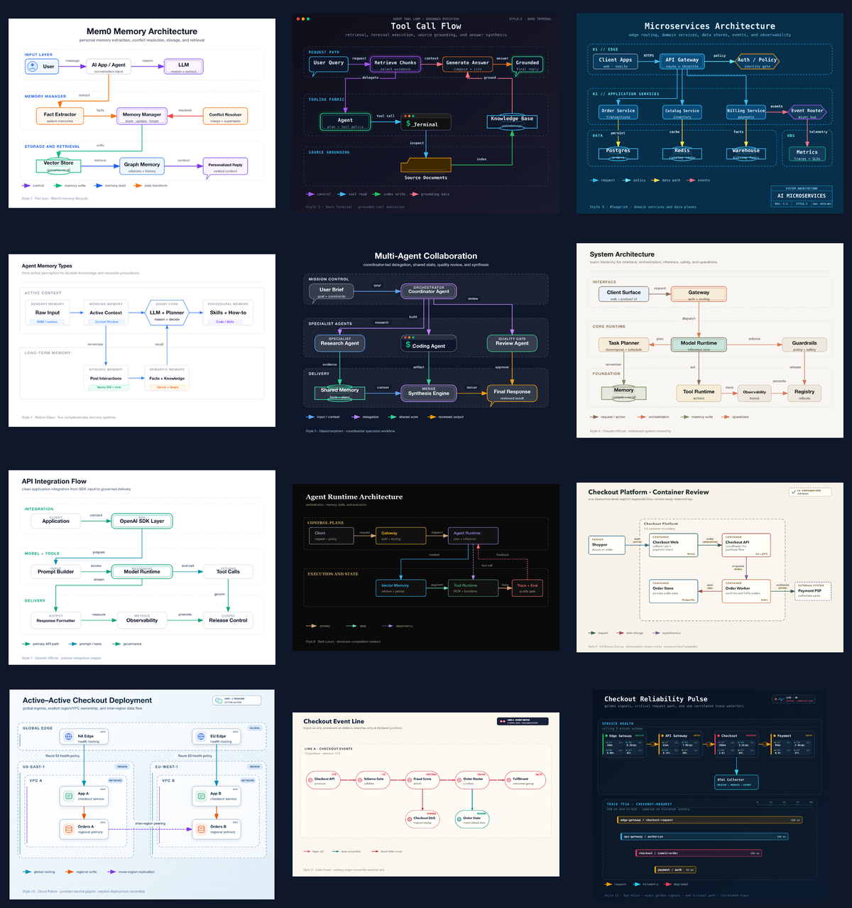

上方 v1.1.0 总览与下方每张大图均来自最终回归集。12 种风格保留各自独立场景，同时统一通过几何、文字适配和线束路由质量门禁。

### 风格 1 — 扁平图标风（默认）
*Mem0 Memory Architecture — 个人记忆抽取、冲突消解、存储与检索*
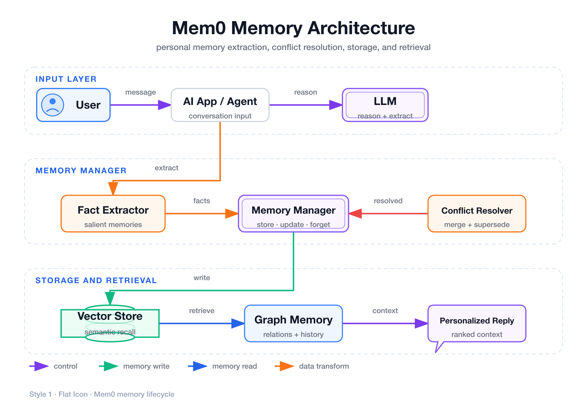

### 风格 2 — 暗黑极客风
*Tool Call Flow — 暗黑终端执行、来源 Grounding、检索与回答合成*
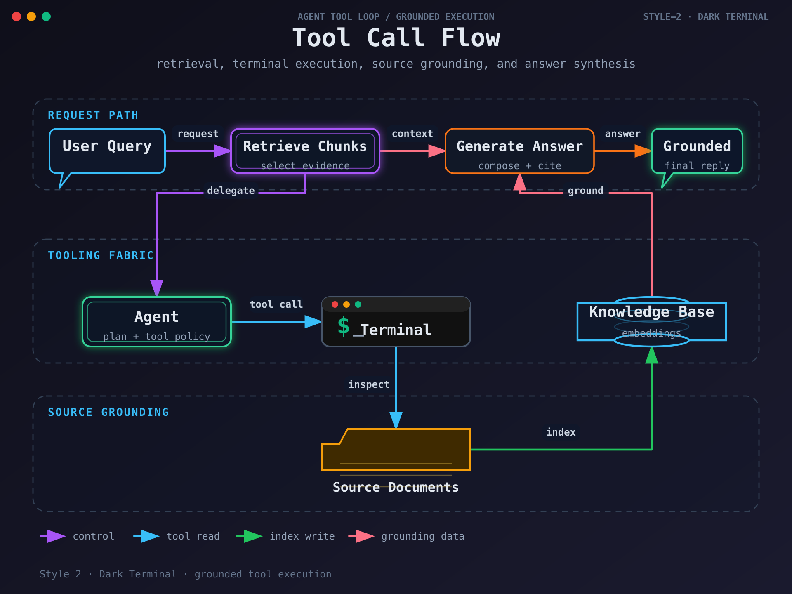

### 风格 3 — 工程蓝图风
*Microservices Architecture — 工程网格、领域服务、数据存储、事件与遥测*
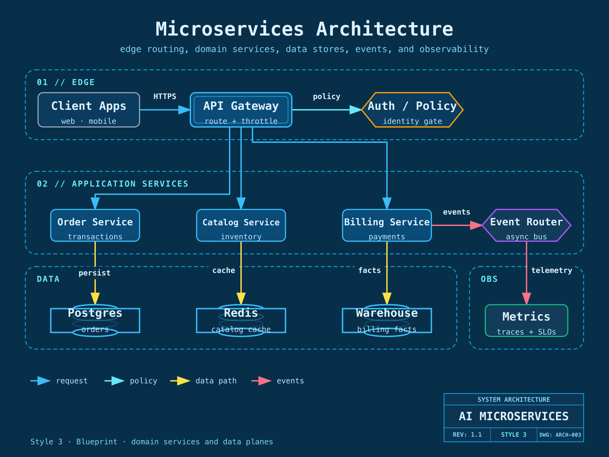

### 风格 4 — Notion 极简风
*Agent Memory Types — 从感知和工作上下文到长期记忆的极简层级*
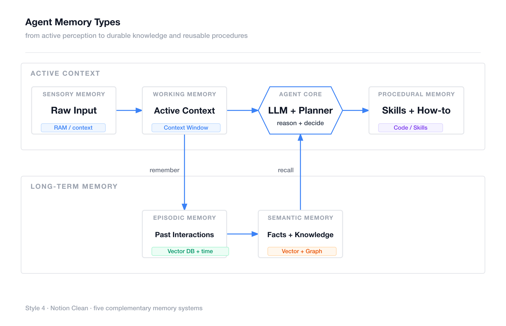

### 风格 5 — 玻璃态卡片风
*Multi-Agent Collaboration — 协调器、专家 Agent、共享状态、评审与合成*
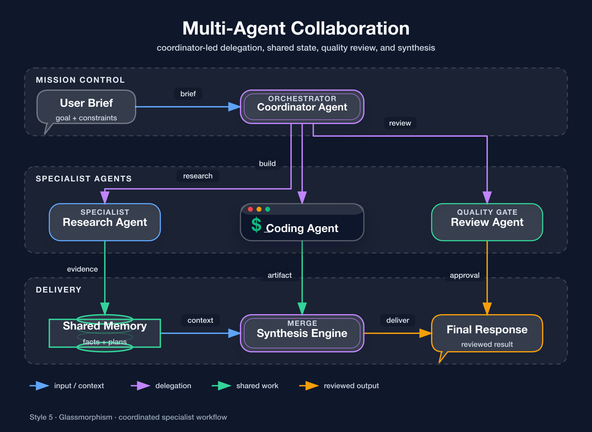

### 风格 6 — Claude 官方风格
*System Architecture — 温暖的界面、Runtime、安全、记忆、工具和运维分层*
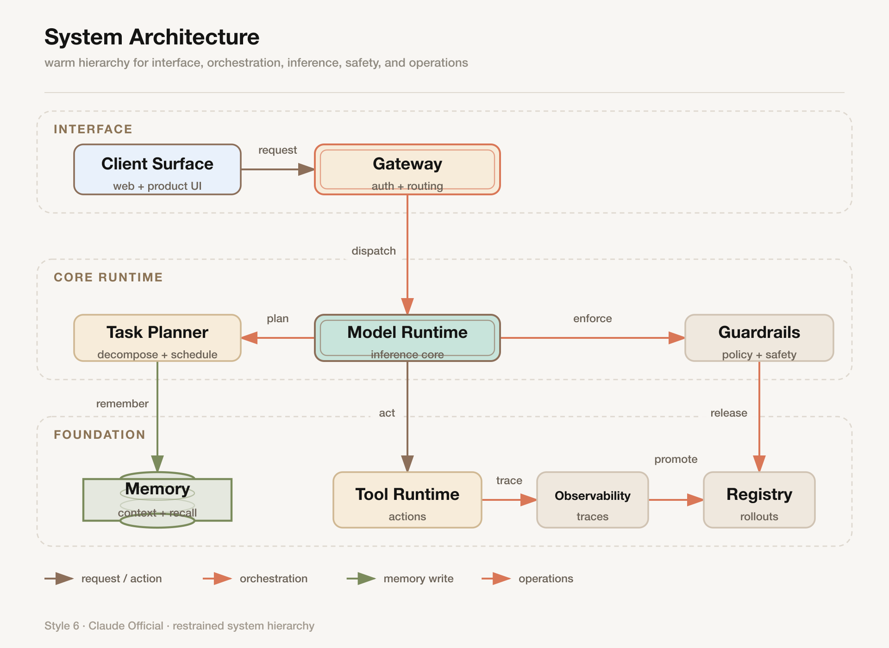

### 风格 7 — OpenAI 官方风格
*API Integration Flow — 清晰的 SDK、Prompt、Model、Tool、交付与发布阶段*
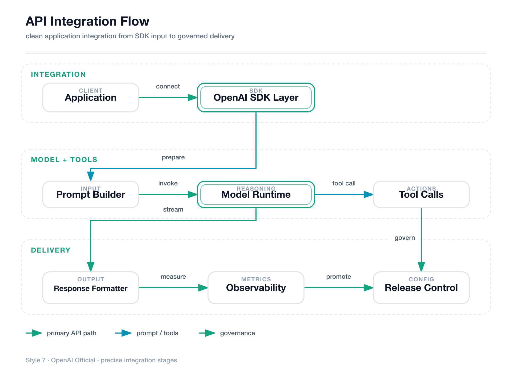

### 风格 8 — 暗黑奢华风 *(AI 手绘)*
*Agent Runtime Architecture — 控制平面、执行与状态分层，香槟金结构线和语义色桶*
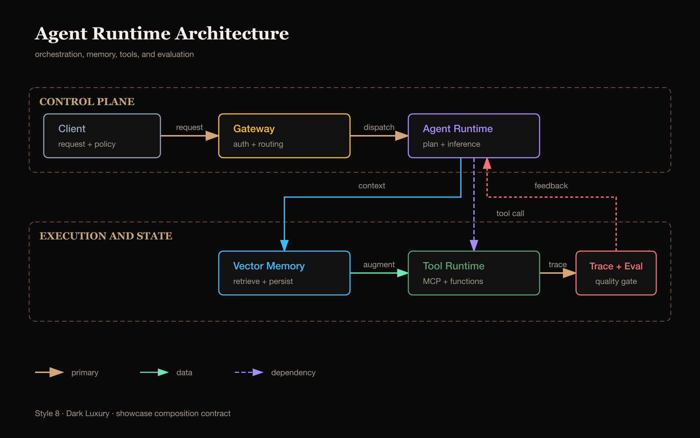

### 风格 9 — C4 评审画布
*Checkout Container Review — 单一抽象层级、明确职责、技术栈与协议*
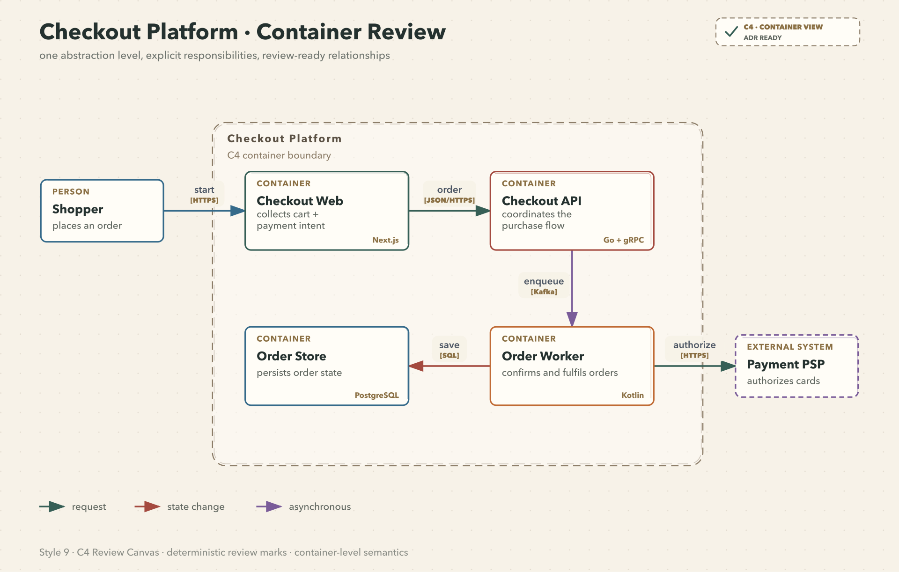

### 风格 10 — Cloud Fabric
*Active–Active Checkout Deployment — 全局入口、Region、VPC 归属与跨区复制*
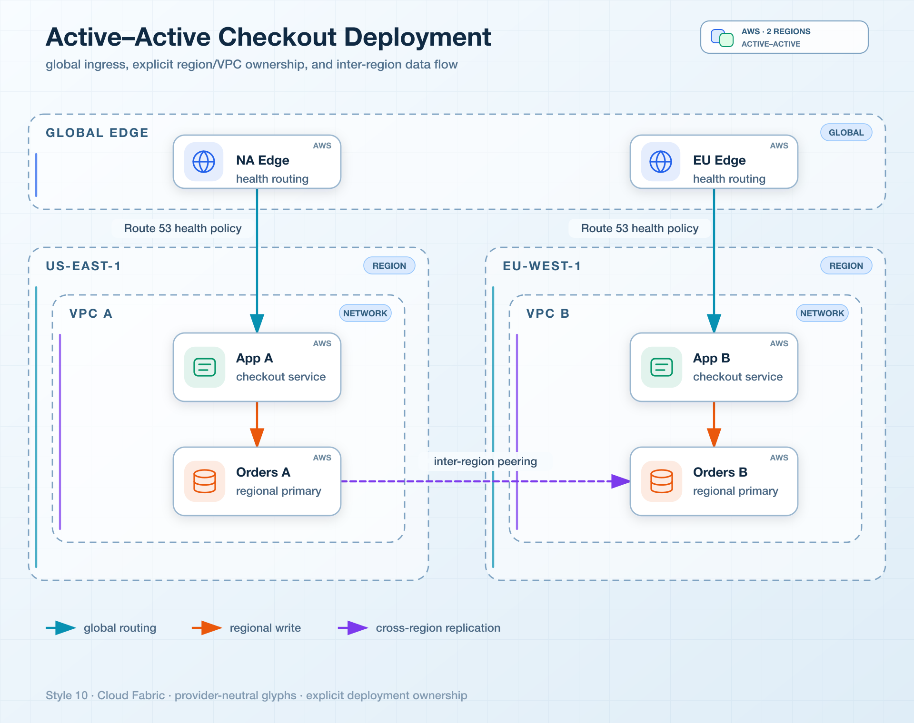

### 风格 11 — Event Transit
*Checkout Event Line — Topic 轨道、处理站点、显式 Junction、DLQ 与状态投影*
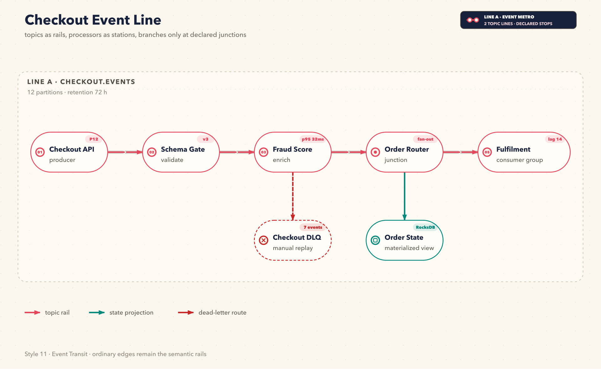

### 风格 12 — Ops Pulse
*Checkout Reliability Pulse — Golden Signals、关键路径、OTel 导出与关联 Trace*
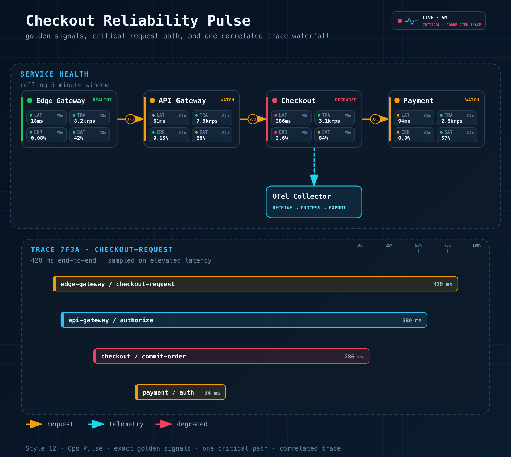

---

## 稳定输出提示词

公开展示保留 12 个互不重复的领域场景；它们通过同一套可执行构图契约保证质量可比。同拓扑回归样例仅保留在 `fixtures/quality-baseline/` 内部使用。

```text
按 style N 对应的场景出图：
1 Mem0 Memory Architecture；2 Tool Call Flow；3 Microservices Architecture；
4 Agent Memory Types；5 Multi-Agent Collaboration；6 System Architecture；
7 API Integration Flow；8 Agent Runtime Architecture；9 C4 Checkout Review；
10 Active–Active Cloud Deployment；11 Checkout Event Line；12 Checkout Reliability Pulse。
保留该场景自己的节点、分区和阅读方向。
应用 showcase 构图质量契约：零交叉、零跨线桥、每条线最多 2 个折点、
全图最多 8 个折点、节点间距至少 40px、容器内边距至少 20px，
正交线段保持简短，标签避开节点、线路和分区标题。
保留所选风格的字体、配色、卡片材质和品牌化细节。
```

新增的四种工程风格可以直接使用下面的“提示词指纹”，让路由同时选中
对应的视觉语言与领域语义契约：

```text
风格 9 · C4 评审画布：只展示一个 C4 层级，包含职责、技术栈、评审状态，以及“动作 + 协议”关系标签。
风格 10 · 多区域云部署图：展示全局入口、Region/VPC 归属、中立云图标、部署模式，以及具名的跨边界机制。
风格 11 · 事件地铁图：使用细 Topic 轨道、编号处理站、显式 Junction、Consumer Group、DLQ 与状态投影。
风格 12 · 可靠性脉冲：固定观察窗口，每个服务展示四个 Golden Signals、编号关键跳、遥测导出和一条关联 Trace。
```

把 `N` 替换为 `1`–`12`。Style 8 仍由 AI 读取 `references/style-8-dark-luxury.md` 手工绘制；Style 9–12 还会执行对应的工程语义契约；所有风格同时加载 `references/composition-quality-contract.md`。

---

## 功能特性

- **12 种视觉风格** — 11 种生成器驱动 + 1 种 AI 手绘（Dark Luxury）
- **工程语义契约** — C4 抽象层级、Deployment 归属、事件轨道拓扑、精确 Golden Signals 在渲染前 fail closed
- **可执行风格系统** — 风格约束不仅写在文档里，也真正进入生成器逻辑
- **几何安全布线** — 确定性的正交路径、强制 waypoint、端口分流、图例自动避让、标签画布约束，以及带遮罩验证的跨线桥
- **版本化 Diagram IR** — 旧 JSON 会归一化为 schema v1；重复 ID、悬空引用、非法 waypoint 和非有限坐标在渲染前直接失败
- **统一 CLI 与交互导出** — 支持 render、validate、inspect，并可导出单文件离线 HTML，包含平移缩放、主题切换、复制和 1×–4× SVG/PNG/JPEG/WebP 导出
- **14 种图类型** — 完整支持全部 UML 图类型（类图、组件图、部署图、包图、复合结构图、对象图、用例图、活动图、状态机图、序列图、通信图、时序图、交互概览图、ER 图）以及 AI/Agent 领域图
- **AI/Agent 领域内建知识** — RAG、Agentic Search、Mem0、Multi-Agent、Tool Call 等常见 Pattern 开箱即用
- **语义形状词汇表** — LLM = 双边框圆角矩形，Agent = 六边形，Vector Store = 带内环圆柱
- **语义箭头系统** — 颜色 + 虚线样式编码含义（写入/读取/异步/循环）
- **结构化 SVG 校验** — XML 解析、`marker-start/mid/end` 完整性，以及 `M/L/H/V/Q/C/S/T` 路径的箭头穿框检测
- **视觉复核门禁** — 交付前回读 PNG，检查裁切、重叠、标签位置和走线回归
- **产品图标库** — 40+ 产品品牌色：OpenAI、Anthropic、Pinecone、Weaviate、Kafka、PostgreSQL……
- **泳道分组** — 自动为复杂架构添加层级标签
- **SVG + PNG 双输出** — SVG 可编辑，1920px PNG 可直接嵌入文章
- **渲染器友好** — 纯内联 SVG，不依赖外部字体；在 cairosvg、rsvg-convert、headless Chrome 下都能稳定渲染

---

## Loop Engineering 设计理念

首轮渲染会被视为候选结果，交付前还要经过一条由 Agent 驱动、轮次受限的 validation feedback loop：

```text
Prompt
  → Diagram Contract
  → Semantic IR
  → Style Spec
  → Route Planner
  → SVG Build
  → Structural Validation
  → PNG Visual Readback
  → Targeted Revision
  → Verified SVG + PNG
```

这条闭环遵循五项原则：

1. **Evaluate, don't assert** — 完成状态必须有 validator 和实际渲染证据，不能只依赖模型对结果的主观判断。
2. **先确定性校验** — 依次检查 XML 结构、marker 引用、路径几何、箭头穿框和渲染可用性，再进入视觉判断。
3. **再做感知验证** — 回读导出的 PNG，检查语法工具无法识别的裁切、标签碰撞、视觉层级、留白和走线质量。
4. **定向修正** — 每轮只修改已诊断的标签、坐标、corridor 或间距，随后重新运行 validator 和 render check。
5. **有界收敛** — 默认最多执行两轮 focused correction，避免进入无上限的自我修改循环。

最终状态会明确报告闭环结果：

```text
validation: passed
visual_review: passed
```

当运行环境无法读取图片时，Skill 会明确报告 `visual_review: skipped (image reader unavailable)`。整个流程保持可观察、可审计，也不会在缺少图片证据时宣称已经完成视觉验证。

---

## 安装

### 推荐：一次安装到 Codex 与 Claude Code

必须使用真正的嵌套 Skill 路径。末尾的 `/skills/fireworks-tech-graph` 不能省略；当前版本的 `skills` CLI 在裸仓库路径下可能只选择根目录的 `SKILL.md`。

```bash
npx -y skills@1.5.17 add \
  yizhiyanhua-ai/fireworks-tech-graph/skills/fireworks-tech-graph \
  --agent codex claude-code -g -y --copy
```

命令会把完整 Skill 分别复制到 Codex 的 `~/.agents/skills/fireworks-tech-graph` 与 Claude Code 的 `~/.claude/skills/fireworks-tech-graph`，其中包含脚本、schema、fixture、模板、测试、参考资料与元数据。

### Codex 的可编辑 Git 安装

```bash
mkdir -p ~/.agents/skills
git clone https://github.com/yizhiyanhua-ai/fireworks-tech-graph.git ~/.agents/skills/fireworks-tech-graph
```

Codex 从 `~/.agents/skills` 发现个人 Skill，并会读取仓库中的可选元数据 `agents/openai.yaml`。

### Claude Code 的可编辑 Git 安装

```bash
mkdir -p ~/.claude/skills
git clone https://github.com/yizhiyanhua-ai/fireworks-tech-graph.git ~/.claude/skills/fireworks-tech-graph
```

Claude Code 从 `~/.claude/skills` 发现个人 Skill，会忽略只供 Codex 使用的 UI 元数据。

### Codex 与 Claude Code 共用一份可编辑仓库

首次安装且 Claude Code 版本不低于 2.1.203 时，可以只保留一份仓库，再把两个发现路径链接到它。创建链接前，先把已有目标目录移开。

```bash
mkdir -p ~/.local/share/agent-skills ~/.agents/skills ~/.claude/skills
git clone https://github.com/yizhiyanhua-ai/fireworks-tech-graph.git ~/.local/share/agent-skills/fireworks-tech-graph
ln -s ~/.local/share/agent-skills/fireworks-tech-graph ~/.agents/skills/fireworks-tech-graph
ln -s ~/.local/share/agent-skills/fireworks-tech-graph ~/.claude/skills/fireworks-tech-graph
```

这样 `SKILL.md`、参考资料、脚本、模板和后续更新在两端始终一致。npm registry 是独立分发渠道，版本可能晚于 GitHub Release。当前 Skill 版本请使用上面的 GitHub 嵌套路径；npm 页面继续用于查看包元数据：

```text
https://www.npmjs.com/package/@yizhiyanhua-ai/fireworks-tech-graph
```

## 更新

通过 `skills` CLI 安装时，重新执行上面的嵌套路径命令。通过 Git 安装时，更新实际安装的那一份仓库：

```bash
git -C ~/.agents/skills/fireworks-tech-graph pull
# 或
git -C ~/.claude/skills/fireworks-tech-graph pull
# 或：共享仓库方式
git -C ~/.local/share/agent-skills/fireworks-tech-graph pull
```

首次安装后重启 Codex 和 Claude Code，让两端重新发现 Skill。后续修改 `SKILL.md` 会自动生效；如果改的是脚本或参考资料而运行时没有看到更新，重启对应运行时。

以上 Shell 命令适用于 macOS、Linux、WSL 和 Git Bash。原生 Windows 请使用 `%USERPROFILE%\.agents\skills` 与 `%USERPROFILE%\.claude\skills` 对应路径。运行脚本需要 Python 3.9+；可选的 Puppeteer 路径需要 Node.js 18+。

---

## 统一 CLI

```bash
SKILL_ROOT="${CLAUDE_SKILL_DIR:-$HOME/.agents/skills/fireworks-tech-graph}"

python3 "$SKILL_ROOT/scripts/fireworks.py" doctor
python3 "$SKILL_ROOT/scripts/fireworks.py" validate architecture "$SKILL_ROOT/fixtures/api-flow-style7.json"
python3 "$SKILL_ROOT/scripts/fireworks.py" render architecture "$SKILL_ROOT/fixtures/api-flow-style7.json" diagram.svg --report layout.json
python3 "$SKILL_ROOT/scripts/fireworks.py" check diagram.svg
python3 "$SKILL_ROOT/scripts/fireworks.py" export-html diagram.svg diagram.html --title "API Integration Flow"
```

HTML 导出是单文件离线产物。导出器会清洗 SVG，并提供平移、缩放、复位、明暗主题、复制 SVG 源码，以及 1×–4× 的 SVG/PNG/JPEG/WebP 下载。

---

## 安装依赖

仓库自带的校验/导出脚本需要 **cairosvg**（推荐）或 `rsvg-convert`。Puppeteer 是 `SKILL.md` 中的高级手动转换方案，不是脚本会自动使用的回退项。

```bash
# 推荐：cairosvg（CSS 支持最好）
python3 -m pip install cairosvg

# 备选：rsvg-convert（系统包，可能丢失 CSS / <foreignObject>）
brew install librsvg                   # macOS
sudo apt install librsvg2-bin          # Ubuntu/Debian

# 验证脚本支持的任一渲染器
python3 -c "import cairosvg; print(cairosvg.__version__)"
rsvg-convert --version
```

| 渲染器 | 渲染质量 | 安装成本 | 适用场景 |
|--------|---------|---------|---------|
| **cairosvg** | ✅ 好 | 一行 `python3 -m pip install` | 默认推荐，平衡最佳 |
| rsvg-convert | ⚠️ 一般 | 系统包 | 没有 Python 环境，简单图形够用 |
| puppeteer | ✅✅ 最佳 | Node + Chromium | D3、Mermaid 或像素级还原的手动浏览器渲染方案 |

> 渲染器对比和 Puppeteer 用法见 [references/png-export.md](references/png-export.md)，浏览器导出脚本位于 `scripts/svg2png.js`。

---

## 使用方式

### 触发词

以下关键词会自动触发 Skill：

```
画图 / 帮我画 / 生成图 / 做个图 / 架构图 / 流程图 / 可视化一下 / 出图
generate diagram / draw diagram / create chart / visualize
```

### 基本用法

```
画一张 RAG 流程图
```

```
生成一张 Agentic Search 架构图
```

### 指定风格

```
画一张微服务架构图，风格2（暗黑极客风）
```

```
生成 Multi-Agent 协作图，玻璃态风格
```

### 指定输出路径

```
生成 Mem0 架构图，输出到 ~/Desktop/
```

```
画一张 Tool Call 流程图 --output /tmp/diagrams/
```

---

## 场景示例集

### AI/Agent 系统

```
画一张 Agentic RAG 和普通 RAG 的对比图，用 Notion 极简风
```
→ 功能矩阵对比：检索策略、Agent 循环、工具调用、延迟、成本

```
生成一张 Mem0 记忆架构图，包含向量库、图数据库、KV 存储和记忆管理器
```
→ 分泳道记忆架构：Input → Memory Manager → 存储层 → 检索输出

```
画一张 Multi-Agent 协作图：Orchestrator 调度 3 个 SubAgent（搜索/计算/代码执行），汇聚到 Aggregator
```
→ Agent 架构，六边形节点 + 工具层 + 结果聚合

```
可视化一下 Tool Call 的执行流程：LLM → Tool Selector → Execution → Parser → 回到 LLM
```
→ 含决策循环的流程图，展示工具调用的完整生命周期

```
画一张 Agent 的 5 种记忆类型图：感知记忆、工作记忆、情景记忆、语义记忆、程序记忆
```
→ 思维导图或分层架构，从感官输入到程序技能的记忆层级

### 基础设施与云架构

```
帮我画一张微服务架构图：Client → API Gateway → [用户服务 / 订单服务 / 支付服务] → PostgreSQL + Redis
```
→ 水平分层架构，每个服务集群一个泳道

```
生成一张数据管道图：Kafka 消费数据 → Spark 处理 → 写入 S3 → Athena 查询
```
→ 数据流图，每条箭头标注数据类型（stream / batch / query）

```
画一张 Kubernetes 部署架构：Ingress → Service → [Pod × 3] → ConfigMap + PersistentVolume
```
→ 架构图，Namespace 用虚线框，流量用实线箭头

### API 与时序流程

```
画一张 OAuth2 授权码流程的序列图：用户 → 客户端 → 授权服务器 → 资源服务器
```
→ 序列图，垂直生命线 + 激活框

```
帮我画一张 ChatGPT Plugin 的调用时序图
```
→ 时序：User → ChatGPT → Plugin Manifest → API → 响应链

### 决策与流程图

```
画一张 AI 应用上线前的质检流程图：代码审查 → 安全扫描 → 性能测试 → 人工审核 → 发布
```
→ 流程图，含菱形决策节点和并行分支

```
生成一张 RAG vs Fine-tuning vs Prompt Engineering 的功能对比图
```
→ 功能矩阵，对比成本、延迟、准确率、灵活性

### 概念图与知识图谱

```
帮我可视化一下 LLM 应用的技术栈：从底层模型到 SDK 到应用框架到部署层
```
→ 分层架构图或思维导图，从模型层到产品层

```
画一张 AI Agent 的核心能力地图：感知 / 记忆 / 推理 / 行动 / 学习
```
→ 以"AI Agent"为中心的放射状思维导图，5 个核心能力分支

---

## 12 种风格

| # | 名称 | 背景色 | 字体 | 适用场景 |
|---|------|--------|------|----------|
| 1 | **扁平图标风** *(默认)* | `#ffffff` | Helvetica | 博客、幻灯片、技术文档 |
| 2 | **暗黑极客风** | `#0f0f1a` | SF Mono / Fira Code | GitHub README、开发者文章 |
| 3 | **工程蓝图风** | `#0a1628` | Courier New | 架构设计文档、工程规范 |
| 4 | **Notion 极简风** | `#ffffff` | system-ui | Notion、Confluence、内部 Wiki |
| 5 | **玻璃态卡片风** | `#0d1117` 渐变 | Inter | 产品官网、演讲 Keynote |
| 6 | **Claude 官方风格** | `#f8f6f3` | system-ui | Anthropic 风格图表，温暖专业美学 |
| 7 | **OpenAI 官方风格** | `#ffffff` | system-ui | OpenAI 风格图表，简洁现代设计 |
| 8 | **暗黑奢华风** *(AI 手绘)* | `#0a0a0a` | Georgia + system-ui | 高级文档、README Hero、技术演讲 |
| 9 | **C4 评审画布** | `#f7f2e8` | Avenir / system-ui | C4 设计评审、ADR、职责边界 |
| 10 | **Cloud Fabric** | `#edf5fb` | Inter / system-ui | 多 Region 部署、VPC/网络归属 |
| 11 | **Event Transit** | `#fbf7ee` | Avenir / system-ui | Kafka/Event Stream、Consumer Group、DLQ |
| 12 | **Ops Pulse** | `#07111f` | SF Mono / Fira Code | SRE 评审、Golden Signals、关键 Trace |

每种风格在 `references/` 目录下都有专属参考文件，包含精确的颜色 Token 和 SVG Pattern。风格 1–7 与 9–12 由生成器驱动；风格 8 使用 AI 手绘构图和静态回归 fixture。
生成器会直接消费 `containers`、语义化 `nodes[].kind`、`arrows[].flow` 以及显式端口锚点；Style 9–12 还会在布局前校验领域字段。

几个很有用的增强字段：
- `style_overrides`：在不复制整套 style 的前提下微调标题对齐或配色 token
- `containers[].header_prefix` / `containers[].header_text`：用于 style 3 这种 `01 // EDGE` 的工程编号分区标题
- `containers[].side_label`：用于 style 6 这类左侧 Layer Label
- `window_controls`、`meta_left`、`meta_center`、`meta_right`：用于终端 / 文档风格的顶部 chrome
- `blueprint_title_block`：用于 style 3 的蓝图标题信息框

### 风格选择指南

**UML 图类型：**
- **类图/组件图/包图**：风格 1（扁平图标风）或风格 4（Notion 极简风）— 结构清晰，易于阅读
- **序列图/时序图**：风格 2（暗黑极客风）— 等宽字体有助于对齐
- **状态机图/活动图**：风格 3（工程蓝图风）— 工程美学适合流程图
- **用例图/交互图**：风格 1（扁平图标风）— 彩色，易于理解

**AI/Agent 图类型：**
- **RAG/Agentic Search**：风格 2（暗黑极客风）或风格 5（玻璃态卡片风）— 科技感强
- **记忆架构**：风格 3（工程蓝图风）— 强调分层存储结构
- **Multi-Agent**：风格 5（玻璃态卡片风）— 磨砂卡片区分 Agent 边界

**文档类型：**
- **内部文档**：风格 4（Notion 极简风）— 极简，适合 Wiki
- **技术博客**：风格 1（扁平图标风）— 彩色，吸引眼球
- **GitHub README**：风格 2（暗黑极客风）— 匹配暗色主题
- **演示文稿**：风格 5（玻璃态卡片风）或风格 6（Claude 官方风格）— 精致专业

**品牌特定：**
- **Anthropic/Claude 项目**：风格 6（Claude 官方风格）— 温暖奶油色背景，品牌感强且克制
- **OpenAI 项目**：风格 7（OpenAI 官方风格）— 简洁白色，OpenAI 配色
- **高级编辑感技术图**：风格 8（暗黑奢华风）— 深黑画布、香槟金层级和语义色桶

**工程评审：**
- **C4/ADR 评审**：风格 9（C4 评审画布）— 单一抽象层级、职责与协议明确
- **云部署评审**：风格 10（Cloud Fabric）— Region/Network 归属与跨边界机制明确
- **事件驱动系统**：风格 11（Event Transit）— Topic、Processor、Consumer Group、状态与 DLQ
- **可靠性/事故复盘**：风格 12（Ops Pulse）— Golden Signals、唯一关键路径与关联 Trace

---

## 支持的图类型

| 类型 | 描述 | 关键布局规则 |
|------|------|-------------|
| **架构图** | 服务、组件、云基础设施 | 水平分层，自上而下 |
| **数据流图** | 数据在系统中的流向 | 每条箭头标注数据类型 |
| **流程图** | 决策树、流程步骤 | 菱形 = 决策，自上而下 |
| **Agent 架构图** | LLM + 工具 + 记忆 | 五层模型：输入/Agent/记忆/工具/输出 |
| **记忆架构图** | Mem0、MemGPT 风格 | 读/写路径分离，记忆层级分明 |
| **序列图** | API 调用链、时序交互 | 垂直生命线，水平消息箭头 |
| **对比图** | 功能矩阵、方案比较 | 列 = 系统，行 = 属性 |
| **思维导图** | 概念地图、发散思维 | 中心节点，贝塞尔曲线分支 |

### UML 图类型支持（14 种）

| UML 类型 | 描述 | 推荐风格 |
|----------|------|----------|
| **类图** | 类、属性、方法、关系 | 风格 1, 4 |
| **组件图** | 软件组件和依赖关系 | 风格 1, 3 |
| **部署图** | 硬件节点和软件部署 | 风格 3 |
| **包图** | 包组织和依赖关系 | 风格 1, 4 |
| **复合结构图** | 类/组件的内部结构 | 风格 1, 3 |
| **对象图** | 对象实例和关系 | 风格 1, 4 |
| **用例图** | 参与者、用例、系统边界 | 风格 1 |
| **活动图** | 工作流、并行流程 | 风格 3 |
| **状态机图** | 状态转换和事件 | 风格 2, 3 |
| **序列图** | 时间顺序的消息交换 | 风格 2 |
| **通信图** | 对象交互和消息 | 风格 1, 2 |
| **时序图** | 状态随时间的变化 | 风格 2 |
| **交互概览图** | 高层交互流程 | 风格 1, 2 |
| **ER 图** | 实体关系数据模型 | 风格 1, 3 |

---

## AI/Agent 领域内建 Pattern

Skill 内置以下领域知识，可直接描述场景生成：

```
RAG Pipeline         → Query → Embed → VectorSearch → Retrieve → LLM → Response
Agentic RAG          → 在 RAG 基础上加入 Agent 循环 + 工具调用
Agentic Search       → Query → Planner → [Search/Calc/Code] → Synthesizer
Mem0 记忆层          → Input → Memory Manager → [VectorDB + GraphDB] → Context
Agent 记忆类型       → 感知记忆 → 工作记忆 → 情景记忆 → 语义记忆 → 程序记忆
Multi-Agent          → Orchestrator → [SubAgent×N] → Aggregator → Output
Tool Call 流程       → LLM → Tool Selector → Execution → Parser → LLM (循环)
```

---

## 形状词汇表

形状在所有风格中保持一致的语义：

| 概念 | 形状 |
|------|------|
| 用户 / 人类 | 圆形 + 身体路径 |
| LLM / 模型 | 圆角矩形，双边框，⚡ |
| Agent / 编排器 | 六边形 |
| 短期记忆 | 虚线边框圆角矩形 |
| 长期记忆 | 实线圆柱体 |
| Vector Store | 带内环圆柱 |
| Graph DB | 三圆簇 |
| 工具 / 函数 | 带 ⚙ 的矩形 |
| API / 网关 | 六边形（单边框） |
| 消息队列 / 流 | 横向管道 |
| 文档 / 文件 | 折角矩形 |
| 浏览器 / UI | 带三点标题栏的矩形 |
| 决策节点 | 菱形 |
| 外部服务 | 虚线边框矩形 |

---

## 箭头语义

| 流类型 | 线宽 | 虚线 | 含义 |
|--------|------|------|------|
| 主数据流 | 2px 实线 | — | 主要请求/响应路径 |
| 控制 / 触发 | 1.5px 实线 | — | 系统 A 触发 B |
| 记忆读取 | 1.5px 实线 | — | 从存储检索 |
| 记忆写入 | 1.5px | `5,3` | 写入/存储操作 |
| 异步 / 事件 | 1.5px | `4,2` | 非阻塞 |
| 反馈 / 循环 | 1.5px 曲线 | — | 迭代推理 |

---

## 文件结构

```
fireworks-tech-graph/
├── SKILL.md                      # 主 Skill 文件 — 图类型、布局规则、形状词汇
├── README.md                     # 英文文档
├── README.zh.md                  # 本文件（中文）
├── references/
│   ├── style-1-flat-icon.md      # 白底风格 — 彩色强调色
│   ├── style-2-dark-terminal.md  # 暗黑风格 — Neon 配色，等宽字体
│   ├── style-3-blueprint.md      # 蓝图风格 — 网格底纹，青色线条
│   ├── style-4-notion-clean.md   # 极简风格 — 白底，单色箭头
│   ├── style-5-glassmorphism.md  # 玻璃态风格 — 深色渐变，磨砂卡片
│   ├── style-6-claude-official.md # Claude 官方风格 — 温暖奶油色，Anthropic 品牌
│   ├── style-7-openai.md         # OpenAI 官方风格 — 简洁白色，OpenAI 品牌配色
│   ├── style-8-dark-luxury.md    # 深黑画布、香槟金、AI 手绘布局
│   ├── style-9-c4-review-canvas.md # C4 评审语义 + 确定性手绘纹理
│   ├── style-10-cloud-fabric.md  # Deployment 归属 + 中性 Cloud Glyph
│   ├── style-11-event-transit.md # Topic 轨道、站点、Junction 与 DLQ
│   ├── style-12-ops-pulse.md     # Golden Signals、关键路径与 Trace Waterfall
│   ├── png-export.md             # 渲染器选择与手动导出方案
│   └── icons.md                  # 40+ 产品图标 + 语义形状模板
├── agents/
│   └── openai.yaml              # Codex 可选 UI 元数据
├── schemas/                      # 版本化 Diagram JSON Schema
├── docs/                         # 能力契约与路线图
├── examples/
│   └── interactive-architecture.html # 离线平移/缩放/导出演示
├── fixtures/
│   ├── mem0-style1.json          # Style 1 · Mem0 记忆场景
│   ├── tool-call-style2.json     # Style 2 · Tool Call 场景
│   ├── microservices-style3.json # Style 3 · 微服务蓝图
│   ├── agent-memory-types-style4.json # Style 4 · 记忆层级
│   ├── multi-agent-style5.json   # Style 5 · 多 Agent 协作
│   ├── system-architecture-style6.json # Style 6 · 系统分层
│   ├── api-flow-style7.json      # Style 7 · API 集成
│   ├── dark-luxury-style8.svg    # Style 8 · AI 手绘 Runtime 场景
│   ├── c4-review-canvas-style9.json # Style 9 · Checkout C4 评审
│   ├── cloud-fabric-style10.json # Style 10 · Active-Active Deployment
│   ├── event-transit-style11.json # Style 11 · Checkout Event Line
│   ├── ops-pulse-style12.json    # Style 12 · Reliability Pulse
│   └── quality-baseline/         # 内部同拓扑质量回归基线
├── scripts/
│   ├── fireworks.py              # 统一 validate/render/check/export CLI
│   ├── diagram_ir.py             # Schema v1 类型化归一层
│   ├── fireworks_geometry.py     # 路由与碰撞共享语义
│   ├── interactive_html.py       # 安全的离线 HTML 导出器
│   ├── generate-diagram.sh       # SVG 校验与 PNG 导出
│   ├── generate-from-template.py # 基于模板生成 SVG 起始文件
│   ├── svg2png.js                 # Puppeteer 高保真导出脚本
│   ├── validate-svg.sh           # 校验与渲染检查入口
│   ├── validate_svg.py           # XML、marker、transform 与路径碰撞检测
│   └── test-all-styles.sh        # 批量测试所有风格
├── tests/
│   ├── test_geometry_contracts.py # 路由与产物几何门禁
│   └── ...                       # IR、CLI、导出器、安装兼容测试
├── tools/                         # 分发、项目一致性、安装 canary
├── skills/fireworks-tech-graph/  # 完整的 npx 兼容物理镜像
├── assets/
│   └── samples/                  # 示例图 PNG
├── templates/
│   ├── architecture.svg         # 架构图模板
│   ├── data-flow.svg            # 数据流模板
│   └── ...                      # 其他图类型模板
└── agentloop-core.svg           # 仓库自带示例 SVG
```

---

## 产品图标覆盖范围

**AI/ML 模型：** OpenAI、Anthropic/Claude、Google Gemini、Meta LLaMA、Mistral、Cohere、Groq、Hugging Face

**AI 框架：** Mem0、LangChain、LlamaIndex、LangGraph、CrewAI、AutoGen、DSPy、Haystack

**向量数据库：** Pinecone、Weaviate、Qdrant、Chroma、Milvus、pgvector、Faiss

**关系型/NoSQL 数据库：** PostgreSQL、MySQL、MongoDB、Redis、Elasticsearch、Neo4j、Cassandra

**消息队列：** Kafka、RabbitMQ、NATS、Pulsar

**云服务 & 基础设施：** AWS、GCP、Azure、Cloudflare、Vercel、Docker、Kubernetes

**可观测性：** Grafana、Prometheus、Datadog、LangSmith、Langfuse、Arize

---

## 故障排查

| 现象 | 原因 | 处理方式 |
|------|------|----------|
| `npx skills add` 后只有 `SKILL.md` | 使用了裸仓库路径，CLI 选中了根 Skill | 使用 `yizhiyanhua-ai/fireworks-tech-graph/skills/fireworks-tech-graph` 嵌套路径重新安装 |
| SVG 校验报告 `edge_node` / `edge_reserved` | 业务线穿过节点、图例或标题区 | 调整端口、`corridor_x/y` 或 waypoint，再重新渲染；不要手工删除 geometry gate |
| SVG 校验报告 `edge_overlap` | 两条业务线共用同一段轨道 | 给边分配独立 corridor 或 waypoint；跨线桥不能修复共线重叠 |
| PNG 为空或纯黑 | SVG 中含外部字体 `@import url()` | 移除 `@import`，使用系统字体栈 |
| PNG 未生成 | 未安装 raster renderer | 推荐 `python3 -m pip install cairosvg`，也可安装 `rsvg-convert` |
| 交互 HTML 导出拒绝 SVG | SVG 含脚本、事件属性、外部链接或 `foreignObject` | 将资源内联并移除 active content 后重新导出 |
| 图底部被截断 | `viewBox` 高度不足 | 增加画布 `height`，再执行严格 geometry check |

---

## License

MIT © 2025 fireworks-tech-graph contributors
